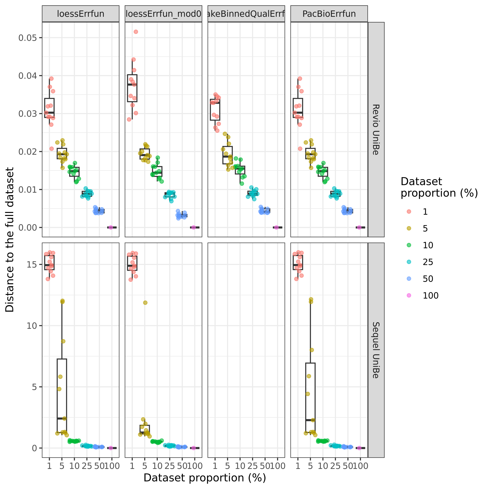
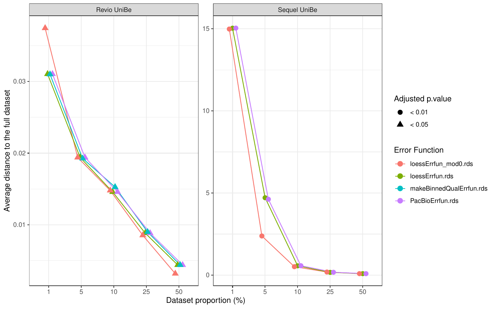
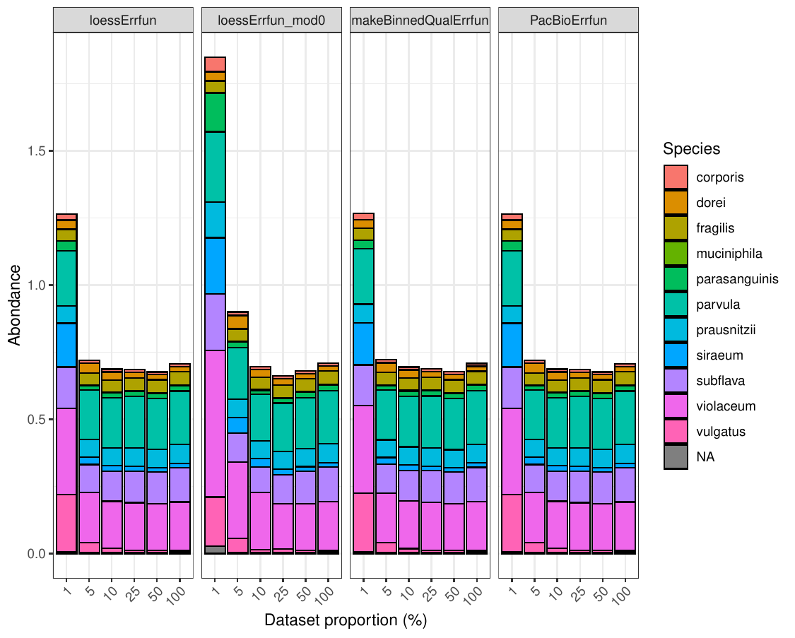
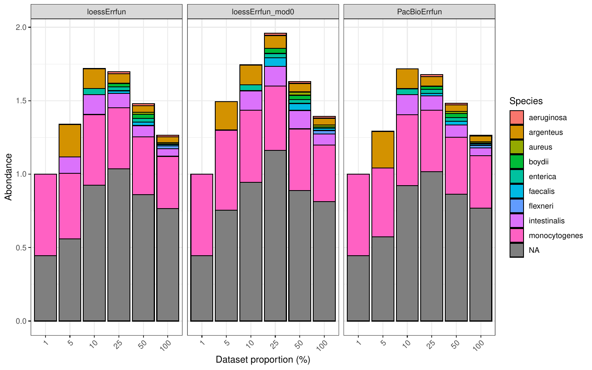

All the important plots are in the summary folder

### Fastq proportional sampling approach

#### Distance to the full dataset comparison

 

#### Taxonomy Comparison

- Revio UniBe dataset

- Sequel UniBe dataset

